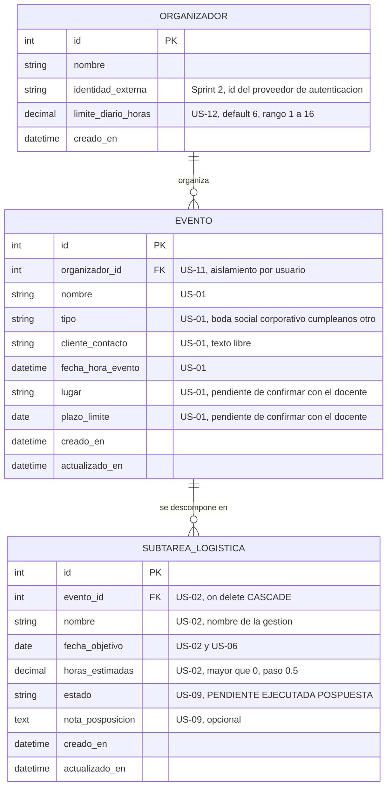

# Modelo de datos

Organizador de Eventos Independientes. Grupo 2, Proyecto Integrador I.

**Estado: propuesta.** Cuatro decisiones siguen abiertas y están listadas al final. El diagrama
refleja la opción recomendada en cada una. Si el equipo decide distinto, este archivo se corrige por
pull request antes de escribir los modelos de Django.

## Diagrama entidad relación

## Regla de trazabilidad

Cada campo tiene anotada la historia de usuario que lo exige. Un campo sin historia detrás no entra
al modelo. El enunciado pide centrarse en lo que piden los requerimientos, y cada columna de más es
trabajo de mantenimiento que nadie pidió.

## Lo que no se guarda porque se calcula

Tres datos parecen campos y no lo son. Guardarlos obliga a mantenerlos sincronizados, y cuando se
desincronizan la interfaz miente sin lanzar ningún error.

| Dato | Cómo se obtiene | Historia |
| --- | --- | --- |
| Vencida, Para hoy o Próxima | Comparar `fecha_objetivo` con la fecha de hoy, excluyendo lo EJECUTADO | US-04 |
| Progreso del evento | Subtareas EJECUTADA sobre el total de subtareas del evento | US-10 |
| Horas planificadas de un día | Suma de `horas_estimadas` de las subtareas con esa `fecha_objetivo` y estado distinto de EJECUTADA | US-07 |

## Campos omitidos a propósito

**`email` y `password_hash`.** Las credenciales las administra un proveedor externo, Supabase Auth
por defecto y Firebase Auth solo si el docente lo exige. La aplicación no es dueña de las
contraseñas, así que no las modela. En el Sprint 2 se agrega `identidad_externa` con el
identificador del usuario en el proveedor que quede elegido.

**Descripción de la subtarea.** US-02 lista los campos mínimos: nombre, plazo y horas estimadas.

**Fecha de ejecución.** US-09 pide guardar el estado, no cuándo cambió.

**Estado del evento.** Ninguna historia lo pide. El progreso se deriva de las subtareas.

## Decisiones abiertas

1. Límite diario: ¿atributo del organizador o entidad propia? El diagrama usa atributo. TS-02
   menciona "configuración de límite diario" entre las entidades, y esa redacción admite las dos
   lecturas.
2. Borrado de evento: ¿cascada o borrado lógico? El diagrama usa cascada.
3. Horas estimadas: ¿enteros o decimales de media hora? El diagrama usa decimales, porque US-08
   permite reducir horas para resolver un conflicto y con enteros una gestión de una hora solo
   podría bajar a cero, que US-02 prohíbe.
4. ¿Una gestión POSPUESTA sigue contando en las horas planificadas de su día? Lectura propuesta: sí,
   porque conserva fecha objetivo. Solo se excluye lo EJECUTADO.

Pendientes de aclarar con el docente: si "lugar/plazo límite" en US-01 son uno o dos campos, y si el
plazo límite es distinto de la fecha del evento.
